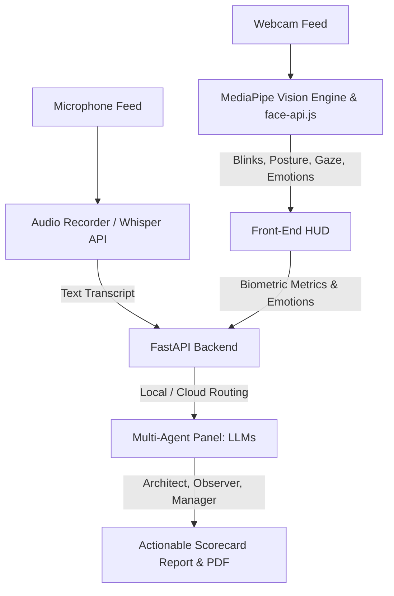

# SentinelAI: Kinematic Stress Engine & Immersive AI Interview Simulator


**SentinelAI** is a state-of-the-art, fully immersive 3D interview simulator that transforms subjective behavioral evaluation into objective, data-driven **Kinematic Biomechanical Analysis** and **Multi-Agent AI Intelligence**. 

By integrating real-time computer vision, client-side emotion classification, and a collaborative panel of specialized AI agents, SentinelAI provides a high-fidelity environment where candidates are evaluated on technical correctness, speech composition, and physical composure under pressure.

---

## 🗺️ System Architecture & Workflow

SentinelAI coordinates data across three layers: **The Eyes (Front-End & Vision)**, **The Brains (Back-End & AI)**, and **The Sync (Analytics & DB)**.



For a detailed breakdown of the project concept and objectives, explore the [SentinelAI Explanation Hub](file:///c:/Users/aimne/SentinelAI/explanation/README.md).

---

## ✨ Key Features

### 1. Immersive 3D Boardroom (Three.js)
*   **React Three Fiber & Drei**: A highly detailed, professional boardroom environment rendered directly in the browser.
*   **Dynamic Avatars**: Animated interviewers that blink, react, and speak (via Google Cloud TTS integration).
*   **Custom Personalities**: Choose from different panel tones, including **Brutal** (high pressure), **Coaching** (supportive), and **Academic** (rigorous).

### 2. Multi-Agent AI Panel (Groq & Local Ollama)
The interview is orchestrated by a specialized panel of AI agents:
*   **The Architect**: Evaluates technical accuracy, code logic, and designs adaptive follow-up questions.
*   **The Manager**: Directs the flow of the interview, handles behavioral assessments, and analyzes speech pacing and clarity.
*   **The Observer**: Silently monitors biomechanical metrics, stress spikes, and emotional stability.
*   **Flexible Routing**: Seamlessly switch between high-speed Cloud models (Groq `llama-3.1-8b-instant`) or fully private, local offline execution using **Ollama**.

### 3. Kinematic Stress Engine (Real-Time Biometrics)
*   **MediaPipe Integration**: Real-time 33-point pose estimation and FaceLandmarker tracking directly on the client side.
*   **Biomechanical Telemetry**:
    *   **Spine Flexion**: Measures neck/spinal angle deviations to capture slouching or postural stress.
    *   **Head Angular Velocity**: Monitors sudden head movements indicating anxiety or distraction.
    *   **Blink Rate & Gaze Stability**: Tracks focus patterns, cognitive load, and eye-contact stability.
*   **YOLOv8 Object Detection**: Real-time background detection to identify environmental distractions or unauthorized reference aids.

### 4. Client-Side Emotion Detection (face-api.js)
*   **7-Emotion Real-Time Classification**: Powered by `face-api.js` (TensorFlow.js), detecting Happy, Neutral, Sad, Angry, Fearful, Disgusted, and Surprised expressions.
*   **Live Spectrum HUD**: Interactive bar charts displaying emotional confidence levels in real time.
*   **Per-Question Emotion Mapping**: Matches the dominant emotion and emotional volatility to specific questions.

### 5. Advanced Evaluation & Premium PDF Reports
*   **Ideal Response Benchmarking**: Side-by-side comparison of candidate responses against high-performing benchmarks generated by the Architect.
*   **Executive Summary**: High-level verdict, overall score, and composure statistics.
*   **Personalized Development Roadmap**: Customized actionable steps and professional growth plans.
*   **Export to PDF**: Professional, multi-page branded PDF scorecard generation featuring clean typography, structured tables, and detailed kinematic analysis.

---

## 🛠️ Setup & Installation

### Prerequisites
*   Node.js 18+
*   Python 3.9+
*   Groq API Key (for cloud models) or Ollama running locally (for offline use)

### Backend Setup
1.  Navigate to the `backend` directory:
    ```bash
    cd backend
    ```
2.  Create and activate a virtual environment:
    ```bash
    python -m venv venv
    # On Windows:
    venv\Scripts\activate
    # On macOS/Linux:
    source venv/bin/activate
    ```
3.  Install dependencies:
    ```bash
    pip install -r requirements.txt
    ```
4.  Create a `.env` file:
    ```env
    GROQ_API_KEY=your_groq_key_here
    GROQ_MODEL=llama-3.1-8b-instant
    DATABASE_URL=sqlite:///./sentinel.db
    ```
5.  Start the FastAPI application:
    ```bash
    python main.py
    ```

### Frontend Setup
1.  Navigate to the `frontend` directory:
    ```bash
    cd frontend
    ```
2.  Install dependencies:
    ```bash
    npm install
    ```
3.  Start the Vite development server:
    ```bash
    npm run dev
    ```

---

## 📁 Project Structure

```text
SentinelAI/
├── backend/
│   ├── agents/          # Architect, Manager, Observer agent logic
│   ├── routes/          # API endpoints (Interview, Detection, Analysis)
│   ├── services/        # Transcription, TTS, Scorecard, and PDF services
│   ├── models/          # SQLAlchemy Database models and schemas
│   └── main.py          # FastAPI application entry point
├── frontend/
│   ├── src/
│   │   ├── three/       # 3D boardroom components and Avatar animations
│   │   ├── pages/       # Setup, Interview, and Scorecard views
│   │   ├── hooks/       # MediaPipe, face-api, and webcam hooks
│   │   └── App.jsx      # React router and application configuration
├── explanation/         # Project Explanation Hub (Problem, Aim, Objectives, Methodology)
│   └── README.md        # Hub navigation menu
├── interview_questions_reference.md  # Central repository of system questions & ideal answers
├── IMPROVEMENTS.md      # Detailed log of recent fixes, PDF enhancements, and lifecycle optimizations
└── README.md            # Primary project documentation
```

---

## 🛡️ Core Principles
*   **Objectivity**: Standardizing first-round assessments to eliminate interviewer fatigue and unconscious bias.
*   **Comprehensive Metrics**: Marrying quantitative biomechanics with qualitative technical response mapping.
*   **Privacy-First**: Full offline compatibility options ensuring candidate data never leaves the local machine.

---

## 🚀 Future Roadmap
*   **Real-Time Feedback HUD**: Adding a subtle real-time "Stress Indicator" or "Clarity Warning" to guide candidates during the live session.
*   **Multi-Language Support**: Expanding transcription (Whisper) and UI localizations (i18n) for international markets.
*   **Additional Agent Personalities**: Adding "The HR Specialist" (soft-skills/value-fit) or "The CTO" (long-term vision/architecture) to the panel.
*   **Persistent WebSockets**: Transitioning detection pipeline from HTTP polling to WebSockets to lower network overhead.

---
*Developed with ❤️ by the SentinelAI Team.*
