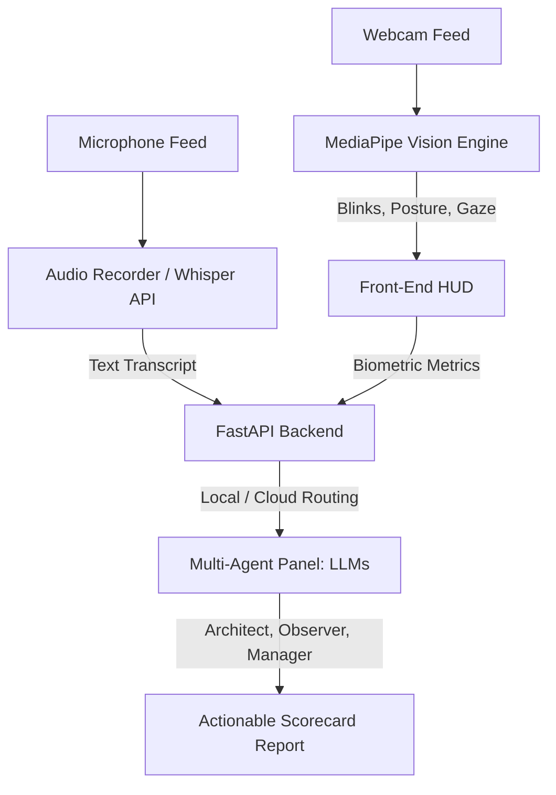

# 🛠️ Methodology

### 🧩 How does SentinelAI work?

We split our methodology into three simple layers: **The Eyes (Front-End & Vision)**, **The Brains (Back-End & AI)**, and **The Sync (Evaluation & Scoring)**.

---

### 1. The Eyes: Front-End & Computer Vision
*   **User Interface:** Built with **React** and **Vite** for incredibly fast rendering.
*   **3D Room:** Designed with **Three.js** to show co-interviewer avatars looking at you, reacting, and blinking.
*   **Biometrics:** Leverages **MediaPipe** in the browser to calculate facial geometry (to track blinks and gaze direction) and skeletal coordinates (to track posture alignment and spinal fatigue) in real-time.

### 2. The Brains: Back-End & Multi-Agent Intelligence
*   **API Framework:** Powered by **FastAPI** (Python), a high-speed framework that coordinates audio files, database queries, and AI agents.
*   **The Interviewer Agents:**
    *   **The Architect (LLM):** Evaluates technical accuracy and designs follow-up questions.
    *   **The Manager (LLM):** Analyzes speech clarity, pace, and counts verbal filler words.
    *   **The Observer (LLM):** Examines physiological metrics, stress spikes, and cognitive load.
*   **AI Routing:** Dynamically directs requests either to secure Cloud models (Groq/Gemini) or a local offline instance (**Ollama**) depending on user preference.

### 3. The Sync: SQLite Storage & Analytics
*   **Database:** A local **SQLite** database stores sessions, questions, answers, and emotional/physical metrics.
*   **Calculations:** A custom kinematics module processes raw physical frame coordinates to calculate cumulative physical fatigue and emotional composure ratings.
